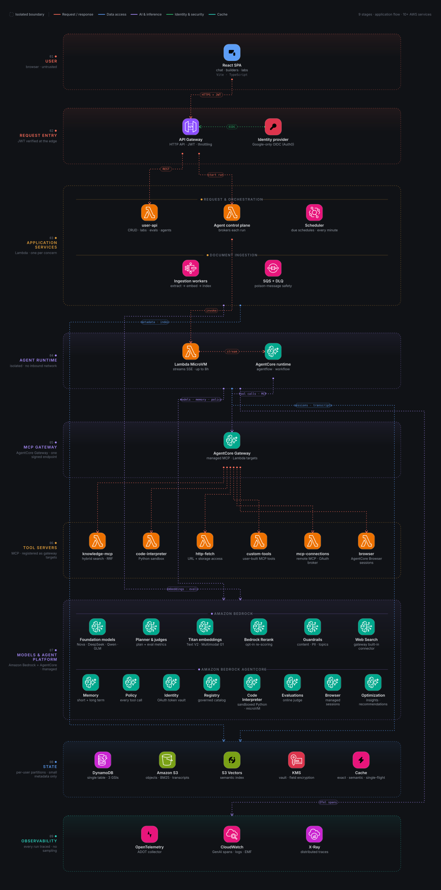
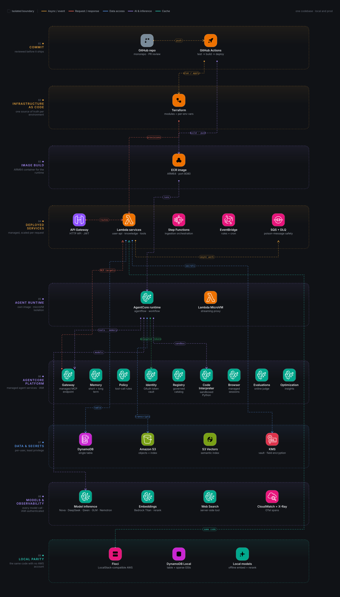
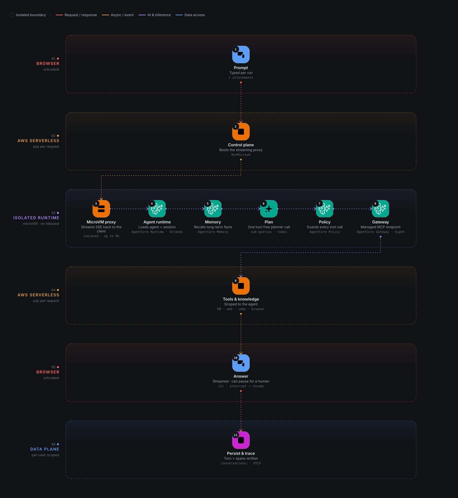
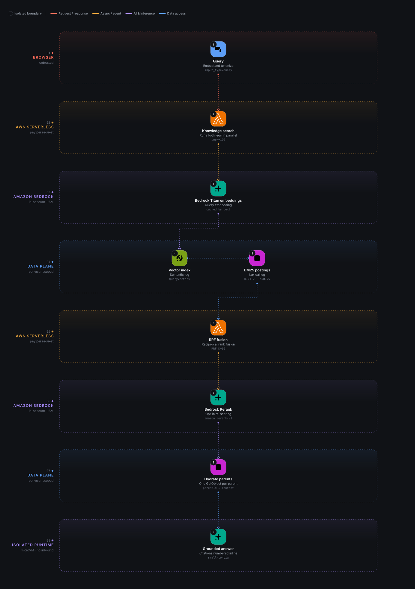
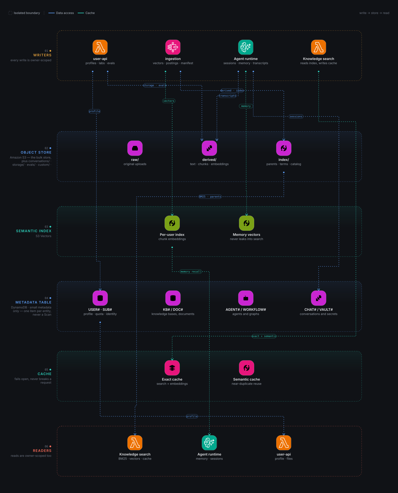
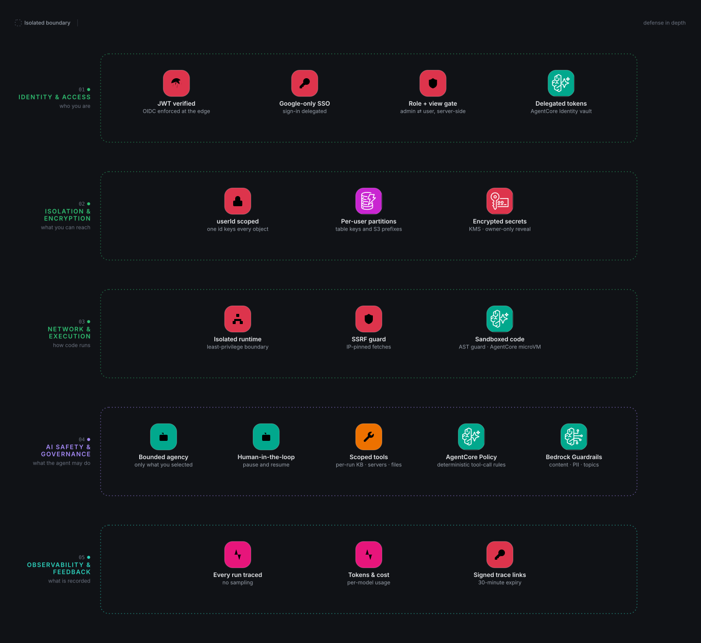

<div align="center">

# get1agent

**An open-source, serverless platform for building, running, and sharing the full stack of AI capabilities — knowledge bases, tools, skills, single agents, and multi-agent workflows — on managed AWS services.**

[](https://github.com/sodekiranavinash/get1agent/actions/workflows/backend-tests.yml)
[](LICENSE)
[](#tech-stack)
[](#tech-stack)
[](#architecture)
[](CONTRIBUTING.md)

[Live](https://www.get1agent.com/) · [Architecture](#architecture) · [Quick start](#quick-start) · [Documentation](#documentation) · [Contributing](CONTRIBUTING.md)

</div>

---

**get1agent** is a multi-tenant platform where you can ingest your own documents, connect real
tools, author reusable skills, and compose them into agents and workflows that answer with
grounded citations — then publish or install them like packages.

It is **fully serverless**: no servers, no clusters, no VPC, and no relational database to scale.
DynamoDB holds small operational metadata, S3 holds bulky artifacts, **S3 Vectors** holds the
semantic index, and **Bedrock AgentCore** runs the agent workers. Every service talks over public
AWS endpoints, so there is nothing to patch and nothing to keep warm. The entire stack also runs
locally on [Floci](https://floci.io) with DynamoDB Local — the same Lambda code, the same state
machine, and the same API routes as production.

> **Project status:** actively developed. This repository is the source for
> [get1agent.com](https://www.get1agent.com/). The stack deploys and runs end to end; some
> listed items are roadmap, marked as such.

## Table of contents

- [Highlights](#highlights)
- [Architecture](#architecture)
  - [How a request flows](#how-a-request-flows)
  - [Components](#components)
  - [Data & retrieval design](#data--retrieval-design)
- [Feature tour](#feature-tour)
- [Tech stack](#tech-stack)
- [Repository layout](#repository-layout)
- [Quick start](#quick-start)
- [Testing](#testing)
- [Deployment](#deployment)
- [Documentation](#documentation)
- [Roadmap](#roadmap)
- [Contributing](#contributing)
- [Privacy & data protection](#privacy--data-protection)
- [Security](#security)
- [License](#license)

## Highlights

<table>
<tr><td width="50%" valign="top">

**🎨 Visual builders**

Compose an agent on a React Flow canvas from knowledge, skills, and tools. Agents get typed
inputs/outputs, planning and task decomposition, long-term memory, context management, streamed
responses, inline citations, and conversation history with run feedback.

</td><td width="50%" valign="top">

**🕸️ Multi-agent workflows**

Deterministic orchestration (Strands `Graph`) and dynamic handoff (`Swarm`) with a host
coordinator, parallel execution, per-node overrides, scheduling, and a live execution timeline —
all runnable from the same chat screen.

</td></tr>
<tr><td width="50%" valign="top">

**📚 Production-grade retrieval**

Multi-format ingestion, chunking, and embedding over **S3 Vectors**, serving grounded, cited
answers via **hybrid semantic + keyword (BM25) search fused with RRF**, opt-in reranking, and
parent-child (small-to-big) retrieval.

</td><td width="50%" valign="top">

**🔧 Extensible tools & skills**

Built-in tools, an AI-assisted workspace to generate and sandbox-test **custom MCP servers** on
AgentCore, secure OAuth 2.0 connections to external MCP servers, and importable
strands-format skills.

</td></tr>
<tr><td width="50%" valign="top">

**🔭 Fully AWS-native — 10+ services**

Every model call, embedding, rerank and trace runs on AWS: **Amazon Bedrock** for inference, and
**AgentCore** for the managed agent platform (runtime, memory, policy, gateway, identity, registry,
evaluations, browser). OpenTelemetry → CloudWatch + X-Ray, an AI-credit budget, an offline
evaluation lab with LLM judges and a marketplace-style agent store.

</td><td width="50%" valign="top">

**🔒 Multi-tenant by design**

Per-user isolation everywhere (DynamoDB partitions, S3 prefixes, S3 Vectors indexes), quotas,
KMS-encrypted secrets in a Vault, and API Gateway JWT auth — with no servers or databases to
manage.

</td></tr>
</table>

## Architecture

These are the **same diagrams the in-app [architecture page](https://www.get1agent.com/architecture)
renders** — generated from the app's own diagram spec and layout engine by
[`frontend/scripts/render-architecture.mts`](frontend/scripts/render-architecture.mts), so the README
can never drift from the product. Regenerate them with **`make architecture`**.

**Platform overview** — every service, boundary and hop

<p align="center">
  
</p>

**Deployment & environments** — delivery, infrastructure as code, local parity

<p align="center">
  
</p>

**Agent run lifecycle** — one run, end to end

<p align="center">
  
</p>

**Knowledge & retrieval** — hybrid semantic + BM25 search

<p align="center">
  
</p>

**Data plane** — one item per entity, never a Scan

<p align="center">
  
</p>

**Security safeguards** — defense in depth

<p align="center">
  
</p>

<p align="center"><sub>Generated from the app spec · source <a href="frontend/scripts/render-architecture.mts">renderer</a> · SVG and PNG exports live in <a href="docs/assets">docs/assets</a></sub></p>

The backend is deliberately boring infrastructure: **managed, per-request, and billed only when
used**. There is no always-on server, no database fleet, and no VPC. Every Lambda reaches
DynamoDB, S3, S3 Vectors, and Amazon Bedrock over public HTTPS.

### How a request flows

1. The browser loads the SPA from **S3 (served through Cloudflare)** and signs in with **Google via Auth0** (OIDC).
2. It calls the **API Gateway HTTP API**, which enforces the Auth0 JWT at the edge and applies
   stage-level plus per-route throttling before any Lambda is invoked.
3. The matching **Lambda service** runs. `user-api` owns the control plane (knowledge bases,
   agents, workflows, skills, storage, vault, conversations, evals); `knowledge-mcp` serves
   retrieval; the MCP servers expose tools; `scheduler` runs saved agents on a cron.
4. Agent runs go through the **agent-run control plane** → a short-lived **Lambda MicroVM**
   streaming proxy → the **Bedrock AgentCore runtime** (an ARM64 container running Strands). The
   runtime validates the JWT again, resolves the user, consults **AgentCore Memory**, routes tool
   calls through **AgentCore Gateway** with **AgentCore Policy** enforced, and streams normalized
   events back as SSE. Model calls go to **Amazon Bedrock** with **Guardrails**, prompt caching and
   structured outputs.
5. Retrieval runs **inside `knowledge-mcp`**: a semantic leg (`S3 Vectors` `QueryVectors`) and a
   lexical leg (BM25 scored in-Lambda from S3 posting objects) execute in parallel and fuse with
   **Reciprocal Rank Fusion**.
6. Uploads go directly from the browser to **S3 via presigned URLs**. An `ObjectCreated` event on
   `raw/` fans out through **EventBridge → SQS → Step Functions**, which runs **extract → embed →
   index** as separate Lambdas.
7. Bulky artifacts — derived text, chunks, embeddings, BM25 postings, parents, sessions,
   transcripts — live in **S3**; the semantic index lives in **S3 Vectors**; only small metadata
   lives in **DynamoDB**.
8. **CloudWatch + X-Ray** receive OpenTelemetry spans for every run, backing the trace view and
   managed **AgentCore Evaluations**; the in-app **Traces, Metrics and Usage** pages are derived
   from the user's stored conversations, run metadata and the usage counters.

### Components

| Layer | What runs there |
|---|---|
| **Client** | React 19 + TypeScript + Tailwind SPA (Vite), served from S3 through Cloudflare |
| **API edge** | API Gateway HTTP API, Auth0 JWT authorizer, throttling |
| **Lambda services** | `user-api`, `knowledge-mcp`, `mcp-connections`, `mcp-tester`, `code-interpreter`, `http-fetch`, `custom-tools`, `browser`, `scheduler`, and the 6 ingestion workers |
| **Agent runtime** | Bedrock AgentCore container (ARM64): `agentflow` (single agent) and `workflow` (multi-agent) built on Strands |
| **Ingestion** | EventBridge + SQS (+ DLQ) + Step Functions driving extract → embed → index |
| **Data plane** | DynamoDB (single table, adjacency list, 3 sparse GSIs), S3, S3 Vectors |
| **AI** | Amazon Bedrock — Titan embeddings + Multimodal, Bedrock Rerank, the curated model set, Guardrails, prompt caching, structured outputs, batch inference |
| **Agent platform** | AgentCore — Runtime, Code Interpreter, Memory, Policy, Gateway, Identity, Registry, Evaluations, Optimization, Browser |
| **Integrations** | AgentCore Web Search (gateway connector), remote MCP servers (OAuth 2.0), CloudWatch/X-Ray + OTel (tracing) |

The shared application code lives once in `backend/packages/` (`core`, `data`, `retrieval`,
`ingestion`) and is **bundled into each Lambda's zip**, never into a layer. **Third-party
dependencies are bundled per Lambda too — there are no Lambda layers.** The canonical deploy
registry is `backend/registry.json`.

### Data & retrieval design

The data model is the part most worth reading. It is a set of deliberate, documented decisions:

- **One item per entity.** A user is a *partition* (`pk=USER#<userId>`), not a row. Profile,
  settings, each KB, each skill, each session, and each conversation are separate items keyed by
  `sk`. Aggregates are never stored as a single JSON blob.
- **Small metadata only in DynamoDB.** Embeddings live in S3 Vectors; BM25 postings, parent text,
  manifests, and staged artifacts live in S3. Vectors, chunks, and postings never enter a
  DynamoDB item.
- **`GetItem`/`Query` only, no `Scan` on the request path.** Reads target a known `pk` (+ `sk`
  prefix) and use the three sparse overloaded GSIs (`byId`, `byUser`, `byStatus`). No N+1.
- **Writes are purpose-built.** Atomic `ADD` counters on their own item (`#QUOTA`), TTL
  (`expiresAt`) for ephemeral items, conditional writes for uniqueness, and idempotent
  delete-then-write per document for ingestion.
- **Hybrid search, always on.** A semantic leg (`topK=100`, filtered by `kbId` + `status=ready`)
  and a lexical BM25 leg (`k1=1.2`, `b=0.75`) run in parallel and fuse with RRF (`K=60`).
- **Small-to-big retrieval.** Only small child chunks (512 tokens, 64 overlap) are embedded and
  searched; each points at a parent (a PDF source page, or a fixed window) that is hydrated with a
  single `GetObject` per unique parent, returning the full parent context, the matched child, and a
  snippet.

The full rationale lives in [`docs/design/design-b-dynamodb-s3.md`](docs/design/design-b-dynamodb-s3.md).

## Feature tour

<details>
<summary><b>Knowledge & retrieval</b> — ingestion, hybrid search, citations</summary>

- **Ingestion.** Upload → S3 `raw/` → EventBridge → SQS (+ DLQ) → Step Functions → **extract**
  (download, parse, chunk) → **embed** (Bedrock Titan) → **index** (vectors, parents, BM25 postings,
  catalog, stats, manifest). Any failure routes to `mark-failed`; a watchdog fails documents stuck
  in `processing`.
- **Formats.** PDF, DOCX, XLSX, Markdown, plain text, and more, via `pymupdf`, `python-docx`, and
  `openpyxl`.
- **Search.** Hybrid semantic + BM25 fused with RRF, opt-in Bedrock Rerank, parent-child
  hydration, and a term-window snippet.
- **Config per KB.** Embedding model and chunk size/overlap are set per knowledge base.
- **Idempotent.** The index stage is delete-then-write per document (manifest-driven), so retries
  and re-uploads re-index cleanly.
- **Caching.** Best-effort embedding and search caches (DynamoDB TTL), plus a semantic cache
  (S3 Vectors) that reuses a cached answer for a near-duplicate query. Single-flight dedupes
  concurrent identical searches. Labs are never cached.
</details>

<details>
<summary><b>Agents</b> — planning, memory, streaming, human-in-the-loop</summary>

- **Planning step.** One short tool-free call produces a JSON plan (a one-line understanding plus
  sub-queries, each owning a todo list). The plan is streamed and folded into the agent's input, so
  the run follows it; a planner failure is non-fatal.
- **Tools.** Knowledge tools under their exact names, built-in MCP servers, the user's custom
  Playground tools, and remote MCP servers — all assembled per run.
- **Skills.** Strands' `AgentSkills` plugin with **progressive disclosure**: only each skill's name
  and description enter the system prompt until the agent decides to load the full instructions.
- **Memory & sessions.** Long-term memory is **AgentCore Memory** (the user is the actor and the
  agent scopes the namespace), with per-conversation S3 sessions so a conversation resumes
  indefinitely.
- **Context management.** A wrapping model view caps every tool result (recent results get a larger
  cap), proactive summarization prevents mid-message context errors, and a `context` frame drives a
  ring meter in the composer.
- **Answer mode & reasoning.** Per-agent `summarize | normal | detailed`, plus a reasoning-effort
  hint, both overridable per run from the composer.
- **Human-in-the-loop.** With auto-approve off, an `ask_user` tool interrupts the run, streams a
  question card, and resumes the *same* run with the user's answer.
- **Attachments.** Storage files are resolved at run time, downloaded, and extracted to text — the
  bytes never leave the runtime and never reach the model.
- **Citations.** Tool results carry numbered sources; the model cites them inline as `[n]`, and the
  UI renders round badges and a source carousel.
</details>

<details>
<summary><b>Workflows</b> — Graph and Swarm multi-agent orchestration</summary>

- Two modes: **Graph** (deterministic — the host dispatches to entry agents, they run along wired
  edges, then a second host pass synthesizes the answer) and **Swarm** (dynamic — the host hands
  off to teammates via an injected `handoff_to_agent` tool), both on Strands.
- The **query card is the host agent** and owns the workflow prompt and model; the run question is
  typed per run and never saved.
- **Per-node overrides** for model, prompt, reasoning, servers, and skills, merged over the agent's
  config at run time; everything else is inherited.
- A shared run timeline shows per-node status, tool calls, and timing; only the final host's text is
  streamed as the answer.
</details>

<details>
<summary><b>Tools, MCP & the MCP Builder</b></summary>

- **Built-in tools:** `web-search` (**AgentCore Web Search** — a gateway connector, not a Lambda),
  `code-interpreter` (AgentCore sandboxes with an AST guard and audit hook), `browser`, and
  `http-fetch` / `list-storage-files` / `read-storage-file`.
- **Remote MCP servers:** an OAuth 2.0 broker (PRM discovery → AS metadata → registration → Auth
  Code + PKCE → token exchange/refresh) plus an aggregator that namespaces every connected server's
  tools and proxies calls with a lazily refreshed token.
- **MCP Builder:** a chat-to-code workspace with a CodeMirror 6 editor, VS Code-style unified diffs
  for AI proposals, undo/redo, checkpoints, and sandbox test runs. Tools are stored in DynamoDB +
  S3 and served by the `custom-tools` MCP server.
- **Skills marketplace:** a curated catalog plus a proxy to the public `claude-plugins.dev`
  registry, GitHub `owner/repo` resolution, and `.md` import.
</details>

<details>
<summary><b>Vault, evaluation & observability</b></summary>

- **Vault.** User secrets are KMS-encrypted and operator-blind at the API surface — the API returns
  only masked previews, and only the owner can `reveal`. Values may be referenced anywhere as
  `{{vault:name}}` and resolved server-side. A provider secret can back an agent's model, so runs
  bill to the user's own key.
- **Evaluations lab.** Datasets and cases are AWS-native (DynamoDB); runs execute the **real retrieval
  path** or re-run a saved agent end to end (service auth), scored separately for retrieval and
  generation with Ragas-aligned LLM judges and deterministic metrics (`context_recall`,
  `context_precision`, `hit_rate`, `mrr`). Unsupported claims and passage labels are kept for
  explainability.
- **Observability.** OpenTelemetry tracing (exported by AgentCore's ADOT collector to CloudWatch +
  X-Ray) for every run, a Metrics page powered by the Lab store, and an expiring, HMAC-signed trace
  link per run. Token/cost accounting uses
  integer micro-USD and a per-model price table.
</details>

## Tech stack

| Layer | Technologies |
|---|---|
| **Frontend** | React 19, TypeScript, Vite, Tailwind CSS 4, React Flow, CodeMirror 6, Radix UI |
| **Backend services** | Python 3.14, AWS Lambda, `awslabs.mcp-lambda-handler`, stdlib-first HTTP clients |
| **Agent platform** | Amazon Bedrock AgentCore — Runtime, Code Interpreter, Memory, Policy, Gateway, Identity, Registry, Evaluations, Optimization, Browser |
| **AI inference** | Amazon Bedrock — Titan Embeddings V2 + Titan Multimodal, Bedrock Rerank, curated models (Nova, DeepSeek, Qwen, GLM, Nemotron), Guardrails, prompt caching, structured outputs, batch inference |
| **Data** | DynamoDB (single table), Amazon S3, S3 Vectors, AWS KMS |
| **Async** | EventBridge, SQS (+ DLQ), Step Functions, EventBridge Scheduler |
| **Auth** | Auth0 (Google OIDC/JWT) |
| **Observability** | CloudWatch + X-Ray (OpenTelemetry via ADOT), AgentCore Evaluations |
| **Infrastructure** | Terraform, GitHub Actions, Cloudflare (DNS), Lambda MicroVMs, ECR |
| **Web search** | Amazon Bedrock AgentCore Web Search (gateway connector; no model access required) |
| **Local development** | Floci (LocalStack-compatible AWS emulator), DynamoDB Local, Ollama, HuggingFace TEI |

## Repository layout

```
.
├── frontend/                 # React + TypeScript + Tailwind SPA (Vite)
├── backend/
│   ├── services/             # Every Lambda app (Python 3.14), grouped by category
│   │   ├── apis/
│   │   │   └── user-api/             # control plane: KBs, agents, workflows, skills, storage,
│   │   │                             #   vault, conversations, evals, support
│   │   ├── admin/
│   │   │   └── mcp-tester/           # admin API (MCP client, credits, support, security)
│   │   ├── mcp/
│   │   │   ├── knowledge-mcp/        # hybrid search MCP server
│   │   │   ├── code-interpreter/     # AgentCore sandbox MCP server
│   │   │   ├── http-fetch/           # fetch + storage access MCP server
│   │   │   ├── browser/              # AgentCore Browser MCP server
│   │   │   ├── custom-tools/         # serves user-built Python MCP tools
│   │   │   └── mcp-connections/      # remote MCP OAuth broker + aggregator
│   │   ├── ingestion/                # dispatcher, extract, embed, index, mark-failed, watchdog
│   │   ├── scheduler/                # cron runner for saved agents & workflows
│   │   ├── agent-run/                # control-plane Lambda + MicroVM streaming proxy
│   │   └── integration-tests/        # moto + in-memory S3 integration suite
│   ├── agents/               # AgentCore runtime container (agentflow + workflow, Strands)
│   └── packages/             # shared modules: core, data, retrieval, ingestion
├── infra/                    # Terraform, deploy scripts, local Floci stack
│   ├── terraform/            # modules + prod/web environments
│   ├── aws/                  # deploy & build scripts
│   └── local/floci/          # docker-compose + provisioning for the local stack
├── docs/                     # design, compliance and architecture assets
│   ├── design/               # architecture & design documents
│   ├── compliance/           # DPDP policies and runbooks
│   └── assets/               # README architecture diagrams (generated from the app spec)
└── README.md
```

Each Lambda app keeps its entry point as `handler.py` and the rest of its code in `src/`; the
`Makefile` copies `handler.py`, `src/`, the shared modules it uses, and its third-party dependencies
(from its own `pyproject.toml`) into the zip.

## Quick start

The whole platform runs locally on **Floci**, a free, LocalStack-compatible AWS emulator — no AWS
account and no auth token. Lambda, API Gateway, S3, SQS, EventBridge, and Step Functions run in
Docker; DynamoDB Local stores operational data. It is the same Lambda code, the same state machine
definition, and the same API routes as production, configured only by environment variables.

### Prerequisites

- **Docker** (with Compose v2)
- **Node.js 22+** and **npm**
- **Python 3.13+** and [`uv`](https://docs.astral.sh/uv/) (for the backend tests)
- `make`

### Run the stack

```bash
git clone https://github.com/sodekiranavinash/get1agent.git
cd get1agent

cp infra/local/floci/env.example .env        # no keys needed — `make floci` forwards your AWS credentials

make floci                                   # build + start + provision; prints the API URL
printf 'VITE_API_URL=/\nVITE_API_PROXY_TARGET=http://get1agent.execute-api.localhost.floci.io:4566\n' \
  > frontend/.env.local
make ui                                      # React app -> http://localhost:5173

make floci-logs                              # follow the Floci logs
make floci-down                              # stop the stack (named volumes are kept)
```

State persists across restarts, so uploaded documents and the retrieval index survive a
`floci-down` / `floci-up`. To reset everything, `docker compose -f infra/local/floci/docker-compose.yml down -v`.

### Useful commands

| Command | What it does |
|---|---|
| `make floci` | Build, start, and provision the whole local stack (incl. the agent) |
| `make ui` | Start the React app on `:5173` |
| `make agent` | (Re)build + start just the agent container (`:8090`) |
| `make floci-build` | Rebuild Lambda zips after code changes |
| `make floci-reload` | Rebuild Lambdas **and** the agent, then re-upload code |
| `make test` | Backend integration tests (moto, no Docker) |
| `make test-unit` | Per-Lambda unit tests |
| `make floci-oauth-proxy` | Loopback forwarder for remote-MCP OAuth |

Local ingestion runs **offline by default** — `EMBED_MODE=local` embeds with the Ollama container so
Floci needs no cloud call. Set `EMBED_MODE=bedrock` to use the real Amazon Titan models instead. The
Ollama container (`mxbai-embed-large`). Retrieval uses `VECTOR_STORE=local` (brute-force cosine; S3
Vectors is not emulated) with `RERANK_MODE=none` or `local` (HuggingFace TEI).

## Testing

```bash
make test          # integration: moto DynamoDB + in-memory S3 (no Docker, no AWS)
make test-unit     # per-Lambda unit tests (stdlib unittest)
```

The integration suite in `backend/services/integration-tests/` gates every deploy, and each Lambda's
own unit tests run before it is packaged. The `Backend tests` workflow runs both on every push and
pull request that touches `backend/**`.

Run a single integration file:

```bash
cd backend/services/integration-tests && uv run pytest test_search.py
```

## Deployment

Deployment happens through **GitHub Actions** (never from a local machine):

| Workflow | Purpose |
|---|---|
| **Infra** | Terraform: DynamoDB, S3 Vectors, S3, Lambdas, API Gateway, KMS, the AgentCore runtime + MicroVM proxy |
| **Frontend** | Build the SPA and sync it to S3 |
| **Backend** | Deploy Lambda code by group (`user-apis`, `knowledge-mcp`, `admin-apis`, `mcp-tools`, `scheduler`, `ingestion-apis`) |
| **Backend tests** | The `make test` suite on pushes and PRs |

For the full picture — Cloudflare DNS, API Gateway setup, and the agent-runtime deploy — see
[`infra/DEPLOY.md`](infra/DEPLOY.md).

## Documentation

| Document | Contents |
|---|---|
| [`AGENTS.md`](AGENTS.md) | The engineering handbook: architecture, data-access rules, and conventions |
| [`docs/design/design-b-dynamodb-s3.md`](docs/design/design-b-dynamodb-s3.md) | The serverless data design and its locked decisions |
| [`docs/design/data-access.md`](docs/design/data-access.md) | The enforceable data-access rules |
| [`docs/design/retrieval-sources.md`](docs/design/retrieval-sources.md) | Retrieval design and sources |
| [`docs/design/ingestion-logic.md`](docs/design/ingestion-logic.md) | The ingestion pipeline in detail |
| [`docs/design/infra.md`](docs/design/infra.md) | Infrastructure rules and deployment topology |
| [`docs/design/frontend.md`](docs/design/frontend.md) | UI conventions and the page map |
| [`docs/compliance/DPDP.md`](docs/compliance/DPDP.md) | DPDP Act compliance: obligations, routes, configuration |
| [`docs/compliance/retention.md`](docs/compliance/retention.md) | Data retention schedule |
| [`docs/compliance/breach-response.md`](docs/compliance/breach-response.md) | Personal-data breach runbook (72-hour notification) |
| [`docs/compliance/data-requests.md`](docs/compliance/data-requests.md) | Handling data-principal requests |
| [`docs/compliance/dpa-register.md`](docs/compliance/dpa-register.md) | Sub-processor DPA tracker (and what a DPA is) |
| [`infra/DEPLOY.md`](infra/DEPLOY.md) | Deploy topology: Cloudflare DNS, API Gateway, Lambdas and the agent runtime |

## Roadmap

- **Managed stdio MCP hosting** — run stateful stdio MCP servers on AgentCore Runtime (containers)
  rather than in Lambda.
- **AWS-native run aggregates** — read run results directly from CloudWatch instead of the local
  run item.
- **Image retrieval** — image embeddings are computed at ingestion but not yet searched.

Ideas and issues are welcome — see [Contributing](#contributing).

## Contributing

Contributions of all kinds are welcome: bug reports, docs, tests, and features. Please read
[`CONTRIBUTING.md`](CONTRIBUTING.md) first, and note that this project follows a
[Code of Conduct](CODE_OF_CONDUCT.md).

Quick version:

1. Fork the repo and create a branch (`feat/...`, `fix/...`, `docs/...`).
2. Keep changes consistent with the surrounding code and the conventions in
   [`AGENTS.md`](AGENTS.md).
3. Run `make test` (and `make test-unit`) before opening a PR.
4. Open a focused pull request describing **what** changed and **why**.

## Privacy & data protection

get1agent is built to comply with the **Digital Personal Data Protection Act, 2023** (India).
The platform is a serverless, per-user system, so the data-rights controls are first-class
products, not paperwork:

- **Consent is recorded and withdrawable** — a first-login gate captures itemised, purpose-specific
  consent (with adult confirmation), stored server-side and changeable at any time.
- **Right of access** — one click produces a machine-readable export of everything we hold
  (`GET /v1/user/export`).
- **Right to erasure** — account deletion erases the profile, documents, files, BM25 index,
  S3 Vectors index, conversations and child partitions, and best-effort removes the Auth0 identity.
- **Grievance redressal** — a dedicated request channel with a published grievance officer and
  response timeline.
- **Data minimisation & retention** — small metadata only in DynamoDB, TTLs on ephemeral data, and a
  documented retention schedule.

The user-facing surfaces are **Privacy & data rights** (`/privacy/rights`) and the sub-processors
page. The engineering detail and operational runbooks live in [`docs/compliance/`](docs/compliance/DPDP.md).

## Security

Please do not open public issues for security vulnerabilities. See [`SECURITY.md`](SECURITY.md) for
the private reporting process.

## License

Released under the [Apache License 2.0](LICENSE).

## Acknowledgements

Built on the shoulders of excellent open source and managed services: [Strands
Agents](https://github.com/strands-agents/sdk-python), [React](https://react.dev/),
[Vite](https://vite.dev/), [Tailwind CSS](https://tailwindcss.com/), [React
Flow](https://reactflow.dev/), [CodeMirror](https://codemirror.net/), [Radix
UI](https://www.radix-ui.com/), [Floci](https://floci.io), the [Model Context
Protocol](https://modelcontextprotocol.io/), and AWS (Bedrock AgentCore, Lambda, DynamoDB, S3, S3
Vectors, Step Functions, EventBridge, SQS, KMS).
